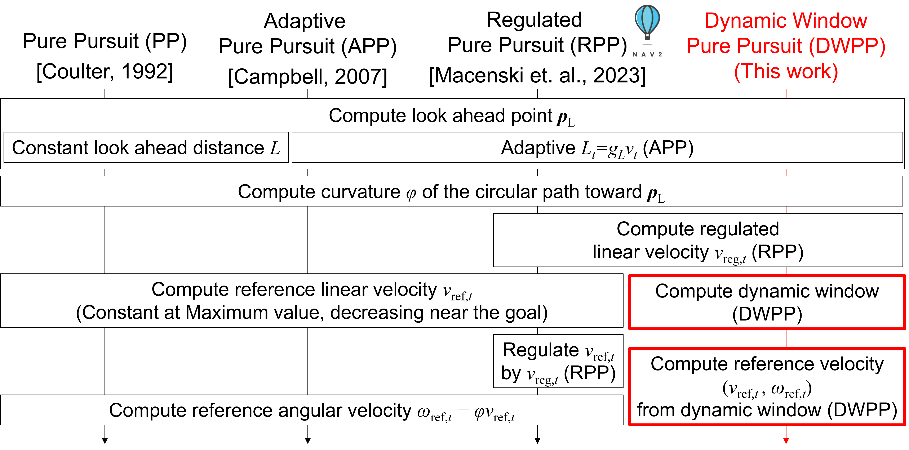
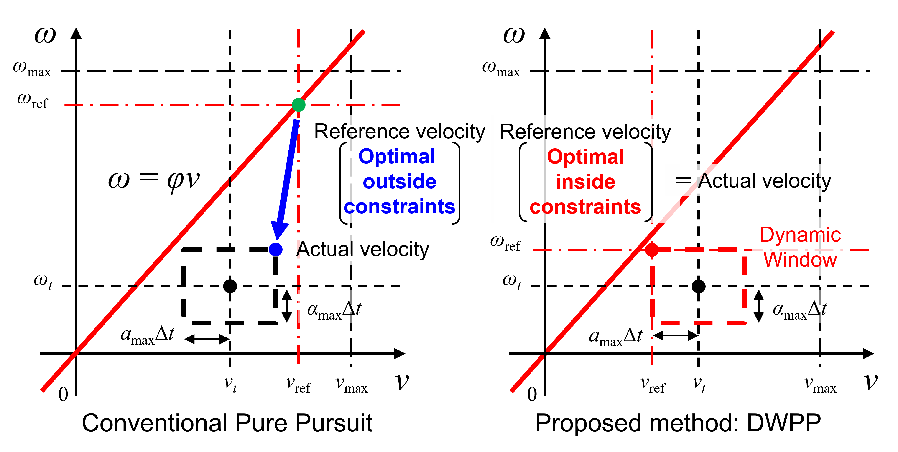

# DWPP algorithm

The proposed Dynamic Window Pure Pursuit (DWPP) makes incremental improvements on RPP to consider the velocity and acceleration constraints. As shown in Fig. 1, DWPP differs from RPP in the following two processes. First, the dynamic *window* — the feasible velocity region for the next control step under the robot’s velocity and acceleration constraints — is computed. Second, from this region, the point closest to the line $\omega = \varphi v$ is selected as the reference velocity. In this way, DWPP explicitly respects velocity/acceleration constraints to compute a path-tracking reference velocity. In this document, we describe the details of the two processes and display the difference of actual velocity realized by RPP and DWPP.

Fig. 1  Processing flow of conventional pure pursuit methods and the proposed method

## Compute dynamic window

First, the maximum and minimum feasible linear and angular velocities at the next calculation step, denoted $v_{t+1,\max}$, $v_{t+1,\min}$, $\omega_{t+1,\max}$ and $\omega_{t+1,\min}$ are computed using the following equations:

$$
v_{t+1,\max} = \min \left( v_t + a_{\max}\Delta t, v_{\max} \right) \tag{1}
$$

$$
v_{t+1,\min} = \max \left( v_t - a_{\max}\Delta t, v_{\min} \right) \tag{2}
$$

$$
\omega_{t+1,\max} = \min \left( \omega_t + \alpha_{\max}\Delta t, \omega_{\max} \right) \tag{3}
$$

$$
\omega_{t+1,\min} = \max \left( \omega_t - \alpha_{\max}\Delta t, \omega_{\min} \right) \tag{4}
$$

where $(v_t, \omega_t)$ are the robot’s current linear and angular velocities, respectively. The terms $v_{\max}, v_{\min}, \omega_{\max}, \omega_{\min}$ are the maximum and minimum linear and angular velocities, and $a_{\max}, \alpha_{\max}$ are the maximum linear and angular accelerations. $\Delta t$ is the control period. Next, the value $v_{t+1,\max}$ is further constrained by the regulated reference linear velocity $v_{\text{reg},t}$, computed by RPP, according to the equation:

$$
v_{t+1,\max} = \max \left( v_{t+1,\min}, v_{\text{reg},t} \right) 
\quad \text{if } v_{t+1,\max} > v_{\text{reg},t} \tag{5}
$$

From the above, the rectangle formed in $v\omega$ space by the four vertices  
$(v_{t+1,\min}, \omega_{t+1,\max})$, $(v_{t+1,\max}, \omega_{t+1,\max})$,  
$(v_{t+1,\max}, \omega_{t+1,\min})$ and $(v_{t+1,\min}, \omega_{t+1,\min})$  
is defined as the dynamic window.

---

## Compute reference velocity from dynamic window

A velocity $(v, \omega)$ that follows a path with curvature $\varphi$ satisfies $\omega = \varphi v$. Accordingly, the method selects the point in the dynamic window closest to the line $\omega = \varphi v$. If multiple candidates exist, the one with the highest linear velocity is chosen.

The corresponding implementation can be found here: 
[https://github.com/Decwest/nav2_dynamic_window_pure_pursuit_controller/blob/main/src/dynamic_window_pure_pursuit_controller.cpp#L82-L174](https://github.com/Decwest/nav2_dynamic_window_pure_pursuit_controller/blob/main/src/dynamic_window_pure_pursuit_controller.cpp#L82-L174)

As shown in the code, the time complexity is $O(1)$.

---

Fig. 2  Visualization of reference velocity computation in $vω$ space

## Difference of actual velocity realized by conventional PP variants and DWPP

Figure 2 illustrates the reference velocity computation of both the conventional PP variants and DWPP within the $v\omega$ space. From this figure, conventional PP first computes the reference velocity (green dot) that best follows the path without considering velocity and acceleration constraints, and then actual velocity (blue dot) restricted by those constraints is realized. In contrast, DWPP chooses the reference velocity (red dot) closest to $\omega = \varphi v$ within the feasible velocity region for the next control step, and actual velocity is directly realized. In other words, DWPP computes the reference velocity that best follows the path within the velocity and acceleration constraints. This makes it possible for DWPP to change the reference velocity to follow the path as precisely as possible, e.g. reduce the linear velocity and increase angular velocity when tracking the path with sharp curvature.
